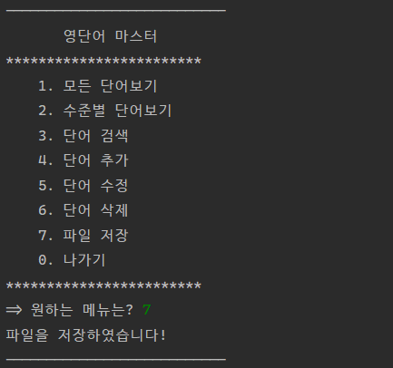

# 실전프로젝트 CRUD 
***
## 과제 1  
#### 단어 추가

  
___  
#### 모든 단어보기

  
___  
#### 나가기

***
## 과제 2
#### 수준별 단어 보기

  
___
#### 단어 검색

___
#### 단어 수정

  
___
#### 단어 삭제

  
___
#### 파일 저장

  
___
#### 파일 불러오기

  
___